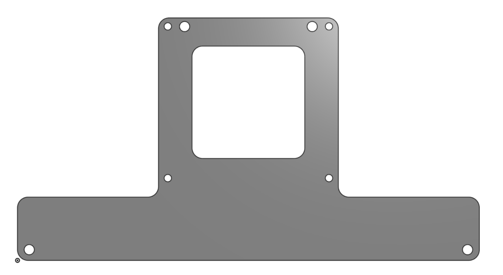

# Hardware & Design

### Romi
The base of the robot is the romi kit, the details of which can be found at [Romi](https://www.pololu.com/category/202/romi-chassis-and-accessories).

For a better 3D view with accurate geometry and dimensions, the solidworks of the kit assembly was utilized:

The kit was assembled with M2.5 fasteners and standoffs. Additionally, an acrylic adapter plate was laser cut to allow the microcontroller to rest above the romi power board.

### R4D5 Shell
For the time and scope of the project, only a stripped down model was designed to house all the Romi components. The outer shell was inspired by STAR WARS astromechs which best suit the shape of the Romi. The shell is split up into three main components which are linked to their respective interactive STL files:
- [Legs](/assets/solidworks/r4d5_Legs.STL)
- [Body](/assets/solidworks/r4d5_Body.STL)
- [Head](/assets/solidworks/r4d5_Head.STL)

The full list of cad files can be found [here](/assets/solidworks).

#### [Home](./README.md) 
